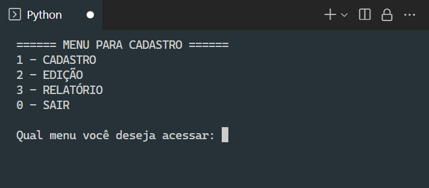

# CadastroPython - _Em andamento_ ⏳

  
  

## 🎯 Propósito

O objetivo desse projeto foi desenvolver um sistema simples de cadastro, em Python. Com a condição de se utilizar a manipulação de arquivos para armazenar, listar e editar dados. Originalmente, esse projeto foi a minha primeira tentativa de criar algo em Python.

## 🧠 Experiência/Motivação

Durante os primeiros anos de faculdade conheci a linguagem **C** e gostei de desenvolver com ela. Minha tarefa para conclusão da disciplina de programação, foi desenvolver um sistema capaz de armazenar, listar e editar os dados de usuários. Tudo isso, utilizando arquivos de texto/binários. **Foi um tremendo desafio!**

A verdade é que, o processo de desenvolvimento é fascinante ❤, não importa a linguagem (_a jornada é sempre incrível, às vezes, melhor do que o destino_). Pensando nisso decidi recriar o sistema em Python.

### Status

* 06/2021 - **Python** é bem melhor que **C** em muitos aspectos, mas é tão instigante quanto. 😅
* 05/2022 - O projeto precisa ser revisado.
* 09/2022 - Foi alterada a estrutura do projeto. Incluído um banco de dados Sqlite para armazenamento de dados.
  * Originalmente o projeto armazenada dados de usuários em um arquivo. Após revisão, o projeto passou a armazenar em um banco de dados local.

## ✍ Como começar
Basta executar o arquivo _main.py_. A partir daí, um menu será exibido no terminal com as opções disponíveis ao usuário.

 
---

#### `1 - CADASTRO`

Ao acessar essa opção, serão requisitadas as seguintes informações ao usuário:

#### Dados Pessoais
* Nome
* Idade
* CPF

#### Endereço
* Rua
* Numero
* Bairro
* Complemento
* UF

Confirmando os dados, o programa irá criar o arquivo **base.txt** e gravar as informações fornecidadas anteriormente (caso o arquivo exista, isto é, já foram cadastrados outros usuários, os novas informações serão apenas adicionadas). 

#### `2 - EDIÇÃO`

Essa função não foi concluída. Será atualizada em breve.

#### `3 - RELATÓRIO`

Essa função realiza um `SELECT` na base de usuários e lista todos aqueles cadastrados:

#### `0 - SAIR`
Essa etapa é simples, não requer nenhum tratamento. Ao informar o valor `0` o programa é encerrado